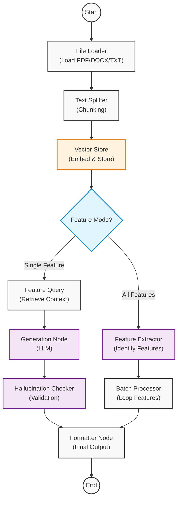

# Application Workflow Graph

This graph visualizes the internal logic of the Test Case Generator, powered by LangGraph.

## Node Descriptions

1.  **File Loader**: Reads the uploaded file content.
2.  **Text Splitter**: Breaks the text into manageable chunks (1000 chars) for processing.
3.  **Vector Store**: Embeds chunks using `nomic-embed-text` and stores them in ChromaDB.
4.  **Feature Mode Check**: Determines if the user requested a specific feature or "all features".
5.  **Feature Extractor**: (Batch Mode) Uses LLM to identify all testable features in the document.
6.  **Batch Processor**: (Batch Mode) Iterates through each extracted feature, running the generation pipeline for each.
7.  **Feature Query**: (Single Mode) Retrieves relevant text chunks for the specific feature.
8.  **Generation Node**: (Single Mode) Uses LLM to generate test cases based on retrieved context.
9.  **Hallucination Checker**: (Single Mode) Validates generated test cases against the source text to ensure accuracy.
10. **Formatter Node**: Formats the final result for the frontend.
